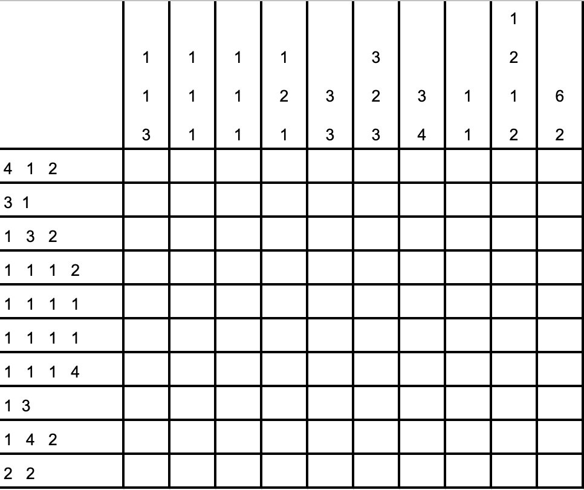
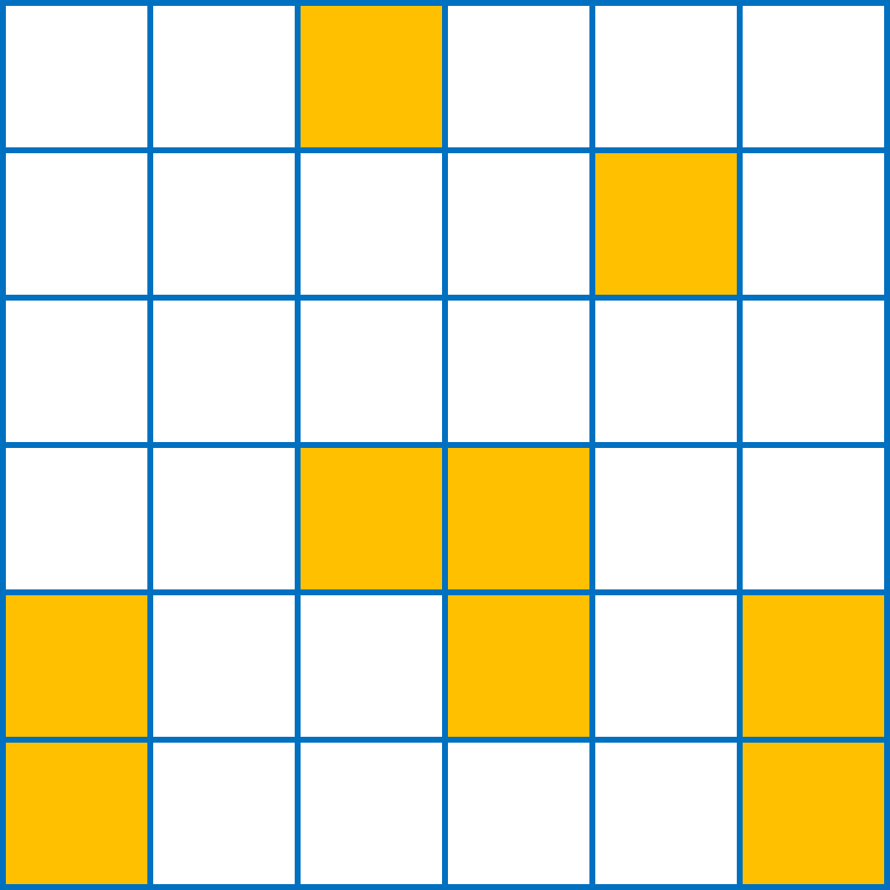

# Mip Master Fun Puzzles
This is a collection of fun puzzles proposed to the Mip Master
community to be solved using MIP.

Most of the puzzles proposed here can be solved with logic in traditional ways,
and we encourage you to do so--consider even sharing with your family and friends!
However, our goal is to use MIP as a way to exercise our ability of solving challenging
real-world problems.

Solving challenging problems requires systematic approaches.
When using the MIP approach, we put effort into understanding the problem (which we have to 
do any ways), then modeling the problem, and implementing the optimization model. 
We do not try to solve the problem, solving is a task for the computer. 

This mindset is crucial to effectively solving real-world analytics problems, 
which is like solving puzzles but in much lager scale.
After all, you can certainly solve a 9X9-sudoku without a computer, but how about solving a 81x81-sudoku?

## #6 - Nonogram
_Aug 2021_  
This is the [Nonogram Puzzle](https://en.wikipedia.org/wiki/Nonogram) 
(also known as *Crucipixel*, *Paint by Numbers*, *Griddlers*, and other names).
The objective is to paint cells to form horizontal and vertical strings. 
The length of each horizontal string is prescribed by the number on the left.
The length of each vertical string is prescribed by the number on the top.
For example, the second row must have two strings of filled cells, the first with length 3 
and the second one with length 1 (the order must be preserved). 
Finally, there must be at least one empty cell between any two horizontal/vertical consecutive strings. 

_Source_: Book [Integer Programming](https://link.springer.com/book/10.1007/978-3-319-11008-0), by
Michele Conforti, Gérard Cornuéjols, and Giacomo Zambelli.  
[Solution](6_nonogram)

## #5 - Continuous Line
*Jul 2021*  
Draw a continuous line that visits every empty cell of the grid exactly once. 
The line can start in any empty cell, but it can only move to a horizontal or vertical 
adjacent cell (diagonal moves are not allowed). 
The line must not visit any of the colored cells.  
  

*Source: Mip Master team.*  
[Solution](5_continuous_line)

## #4 - Darts
*Jul 2021*  
Andrea, Antônio, and Luiz were playing darts. They each threw 6 darts (red marks), 
and each scored 71 points. Andrea’s first 2 darts scored 22 points. 
Antônio’s first dart scored 3 points. Who hit the bullseye?
  

*Source: Adapted from [The Opex Analytics Weekly Puzzle](
https://www.amazon.com/Opex-Analytics-Weekly-Puzzle-Probability/dp/1731343647) book, Volume II.*  
[Solution](4_darts)

## #3 - Digits Tracking
*Jun 2021*  
Consider the list of cells in the figure below.  
  
Each cell has a label which is a digit from 0 to 9. 
The goal is to place a digit, from 0 to 9, in each of the 10 cells in a way that the digit placed 
in cell `i` equals the number of times the digit `i` appears in the list.
For example, if digit 2 is placed in Cell 1, then digit 1 must be placed in exactly two cells.

*Source: [Puzzle Corner - MIT](https://cs.nyu.edu/~gottlieb/tr/back-issues/).*  
[Solution](3_digits_tracking)

## #2 - Even/Odd Sudoku
*Jun 2021*  
Same rules of the standard sudoku, i.e., the digits 1 through 9 into the grid so that no digit repeats 
in any row, column, or bold region. In addition, cells with a square must contain an even digit 
and cells with a circle must contain an odd digit.  

*Source: [The Art of Puzzles](https://www.gmpuzzles.com/blog/2021/03/even-odd-sudoku-by-swaroop-guggilam/).*  
[Solution](2_even_odd_sudoku)

## #1 - Clueless Sudoku
*May 2021*
Same rules of the standard sudoku, i.e., fill the digits 1 through 6 into the grid so that no digit repeats 
in any row, column, or bold region. In addition, the sum of the digits in every bold region is the same.

There are 14 bold regions (also called blocks) as can be identified by the different colors in the figure and also
defined here:    
`1: [(1, 1), (1, 2), (1, 3), (2, 1)], 2: [(1, 4), (1, 5), (2, 5)], 3: [(1, 6), (2, 6)], 4: [(2, 2), (2, 3)], 
5: [(2, 4), (3, 4)], 6: [(3, 1), (4, 1)], 7: [(3, 2), (3, 3), (4, 3)], 8: [(3, 5), (3, 6), (4, 5)], 
9: [(5, 1), (5, 2), (4, 2)], 10: [(4, 4), (5, 4)], 11: [(5, 5), (5, 6), (4, 6)],
12: [(6, 1), (6, 2)], 13: [(5, 3), (6, 3)], 14: [(6, 4), (6, 5), (6, 6)]`

*Source: Adapted from the book
[The Opex Analytics Weekly Puzzle](https://www.amazon.com/Opex-Analytics-Weekly-Puzzle-Probability/dp/1731343647).*  
[Solution](1_clueless_sudoku)